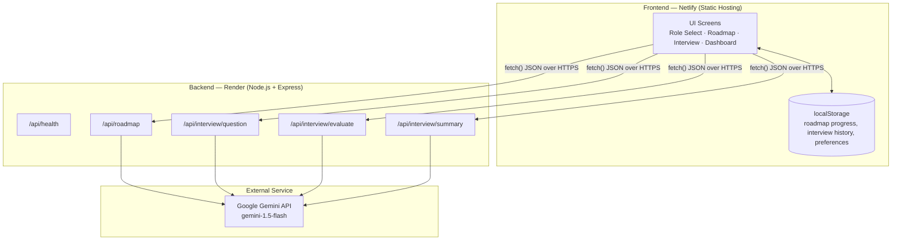
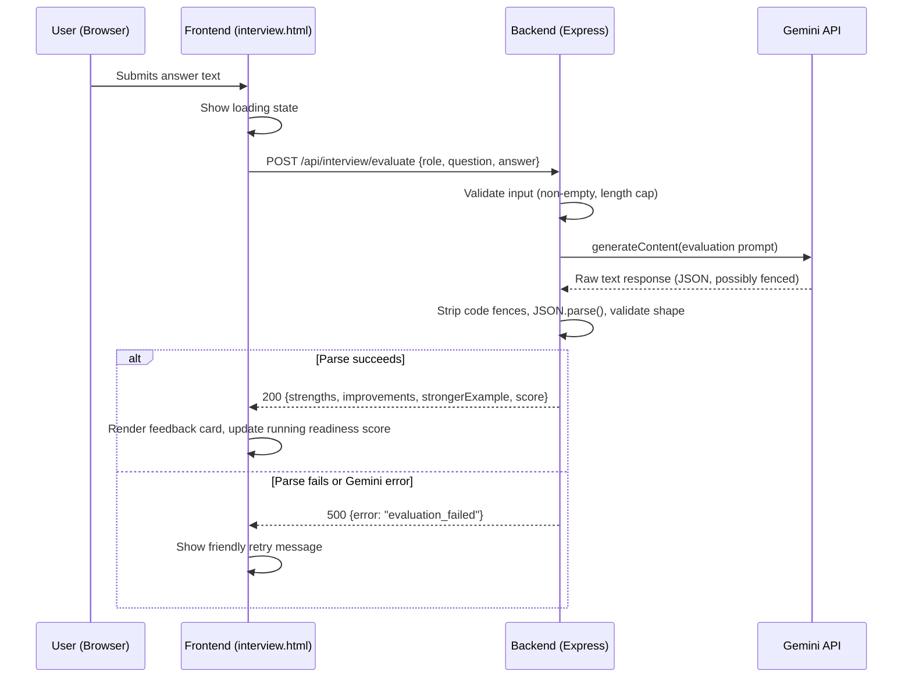

# CareerCopilot AI — System Architecture

**Status:** Approved Day 2 Design — Source of Truth
**Depends on:** PRD v1.0, Implementation Blueprint (Days 2–10)

This document defines the full technical architecture for CareerCopilot AI v1.0. It does not introduce new scope — it formalizes the architecture implied by the PRD and Blueprint into precise, buildable detail.

---

## 1. Tech Stack Summary

| Layer | Technology | Reasoning |
|---|---|---|
| Frontend | HTML5, CSS3, Vanilla JavaScript | No framework overhead; matches builder's existing skills; trivial static hosting |
| Backend | Node.js + Express | Simple REST API; matches builder's existing Node/Express experience |
| Database | None (Browser `localStorage`) | PRD explicitly excludes login/cloud DB from v1.0 |
| Authentication | None (v1.0) | Explicitly out of scope; removes an entire risk category from a 10-day build |
| AI Model | Google Gemini API (`gemini-1.5-flash`) | Free tier, fast, strong structured JSON output |
| Frontend Hosting | Netlify (free tier) | GitHub-connected auto-deploy for static sites |
| Backend Hosting | Render (free tier) | GitHub-connected auto-deploy for Node web services, supports env vars |
| Version Control | Git + GitHub | Already in use; portfolio visibility |

---

## 2. Component Diagram



**Why this shape:** The frontend never talks to Gemini directly — the API key must never be exposed to the browser. All AI calls are proxied through the Express backend, which holds the key as a server-side environment variable. This is a hard security requirement, not a style choice.

---

## 3. Data Flow — Full User Journey

```mermaid
flowchart LR
    A[User selects role] --> B[Frontend saves role to localStorage]
    B --> C[Frontend calls POST /api/roadmap]
    C --> D[Backend prompts Gemini for structured roadmap JSON]
    D --> E[Frontend renders roadmap + saves checkbox state to localStorage]
    E --> F[User starts mock interview]
    F --> G[Loop: question → answer → evaluate → feedback, 5x]
    G --> H[Backend generates final summary via Gemini]
    H --> I[Frontend saves session to localStorage interview history]
    I --> J[User views Dashboard: score, history, learning progress]
```



---

## 4. Request Lifecycle — Interview Answer Evaluation (Most Complex Interaction)



This same request/response/error pattern applies to `/api/roadmap`, `/api/interview/question`, and `/api/interview/summary` — only the prompt template and response shape change.

---

## 5. AI Interaction Design

- **All AI calls are server-side only.** The Gemini API key lives in `server/.env` (local) or Render's environment variable dashboard (production) — never in frontend code or committed to Git.
- **Structured JSON output is enforced via prompt instruction**, not a schema-validation library (keeps v1.0 simple). Every prompt template ends with an explicit instruction: *"Respond with valid JSON only, no markdown formatting, no explanation."*
- **Defensive parsing:** Gemini occasionally wraps JSON in ` ```json ` fences — the backend strips these before `JSON.parse()`. If parsing still fails, the backend returns a structured error (`500 {error: "..."}`, never a raw crash).
- **In-memory caching (optional, Day 4):** Roadmap responses can be cached by role in a simple backend object to reduce redundant Gemini calls during testing/demo — not persisted, resets on server restart. This is a performance optimization, not a scope change.

---

## 6. External Services

| Service | Purpose | Free Tier Limits to Be Aware Of |
|---|---|---|
| Google Gemini API | All AI generation (roadmap, questions, evaluation, summary) | Rate limits apply on free tier — backend should handle 429 errors gracefully with a friendly message |
| Netlify | Frontend static hosting | Free tier: 100GB bandwidth/month — more than sufficient for a portfolio demo |
| Render | Backend Node hosting | Free tier: service "spins down" after ~15 min idle; cold start takes 30–60s on first request after inactivity. This is a known, documented limitation (see Blueprint Day 9 debugging tips) |

---

## 7. Security Notes for v1.0

- No user authentication means no user-specific server-side data — the backend is stateless per request. This significantly reduces attack surface.
- CORS is configured to allow only the deployed Netlify frontend origin (plus `localhost` during development) — prevents arbitrary sites from calling the backend.
- `.env` is git-ignored; the API key is never committed. Production key lives only in Render's environment variable dashboard.
- Input validation on all backend routes rejects empty or excessively long answers before they reach Gemini (cost and abuse protection).

---

## 8. Alignment Check Against PRD

| PRD Requirement | Architectural Support |
|---|---|
| FR-1–FR-3 (role selection, roadmap, milestones) | `/api/roadmap` + localStorage roadmap progress keys |
| FR-4–FR-7 (interview flow, evaluation, summary) | `/api/interview/*` routes + client-side session state machine |
| FR-8–FR-9 (dashboard, persistence) | localStorage aggregation, read entirely client-side, no backend involved |
| FR-10 (responsive UI) | Static frontend, CSS-only concern, no architectural impact |
| NFR: Cost (free-tier only) | Every component chosen specifically for its free tier |
| NFR: Reliability | Predefined roles + structured prompts minimize AI output variance |

No conflicts found between this architecture and the approved PRD/Blueprint.
