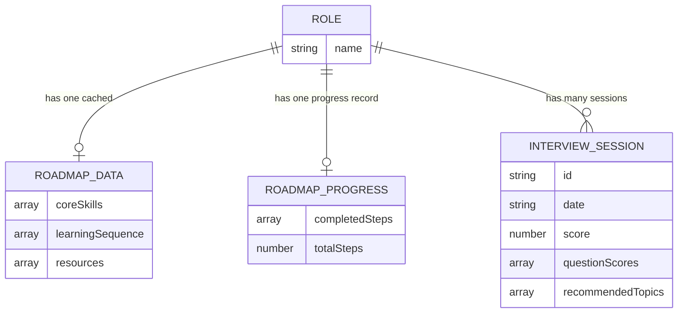

# CareerCopilot AI — Data Schema (localStorage)

**Status:** Approved Day 2 Design — Source of Truth

## A Note on "Database Design"

CareerCopilot AI v1.0 has **no traditional database** — this is an intentional, PRD-approved decision (see PRD §5.4, §6), not a gap. All persistence happens client-side via the browser's `localStorage` API, which removes an entire category of backend complexity (schema migrations, hosting, auth-to-data mapping) that isn't needed for a no-login v1.0 product.

This document defines the **localStorage schema** — the equivalent of "tables and fields" for this architecture — and validates it against every relevant PRD user story, exactly as a database schema would be validated.

---

## 1. Key Design Principles

- Every key is prefixed `cc_` (CareerCopilot) to avoid collisions with other localStorage usage in the browser.
- All values are stored as JSON strings (`JSON.stringify()` on write, `JSON.parse()` on read) since localStorage only stores strings natively.
- Keys are designed so each screen (Roadmap, Interview, Dashboard) reads/writes only the keys relevant to it — no single monolithic blob.

---

## 2. Schema Definition

### `cc_selected_role`
**Purpose:** Tracks the user's currently active role selection, passed between Role Select → Roadmap → Interview screens.
**Type:** `string`
**Example value:** `"AI/ML Engineer Intern"`
**Written by:** `role-select.html` on "Continue" click
**Read by:** `roadmap.html`, `interview.html`

---

### `cc_roadmap_data_<role>`
**Purpose:** Caches the AI-generated roadmap per role so it doesn't need to be regenerated on every visit (also protects against Gemini rate limits).
**Type:** `object`
**Fields:**
| Field | Type | Description |
|---|---|---|
| `coreSkills` | `string[]` | List of key skills for the role |
| `learningSequence` | `{step: string, description: string}[]` | Ordered learning steps |
| `resources` | `{title: string, type: string, description: string}[]` | Recommended resource types |
| `generatedAt` | `string (ISO date)` | Timestamp for potential future cache invalidation |

**Example key:** `cc_roadmap_data_AI/ML Engineer Intern`
**Written by:** `roadmap.html` after successful `/api/roadmap` call
**Read by:** `roadmap.html` (checks cache before calling backend again)

---

### `cc_roadmap_progress_<role>`
**Purpose:** Tracks which roadmap milestones the user has checked off, per role.
**Type:** `object`
**Fields:**
| Field | Type | Description |
|---|---|---|
| `completedSteps` | `number[]` | Array of completed step indices (matches `learningSequence` index) |
| `totalSteps` | `number` | Total step count for that role's roadmap (for progress % calculation) |

**Example key:** `cc_roadmap_progress_Data Analyst`
**Written by:** `roadmap.html` on checkbox toggle
**Read by:** `roadmap.html`, `dashboard.html` (Learning Progress section)

---

### `cc_interview_history`
**Purpose:** Stores the full record of completed mock interview sessions across all roles — powers the Dashboard's session history table and score aggregation.
**Type:** `array of objects`
**Fields (per session):**
| Field | Type | Description |
|---|---|---|
| `id` | `string` | Unique session ID (e.g., timestamp-based) |
| `role` | `string` | Role practiced |
| `date` | `string (ISO date)` | When the session was completed |
| `score` | `number` | Final readiness score (0–100) |
| `questionScores` | `number[]` | Individual per-question scores (0–10 each), for potential future detail views |
| `recommendedTopics` | `string[]` | Topics from the AI-generated final summary |

**Example value:**
```json
[
  {
    "id": "sess_1717689600000",
    "role": "AI/ML Engineer Intern",
    "date": "2026-08-07T10:30:00Z",
    "score": 78,
    "questionScores": [8, 7, 9, 6, 8],
    "recommendedTopics": ["Model evaluation metrics", "SQL joins"]
  }
]
```
**Written by:** `interview.html` on session completion (summary screen)
**Read by:** `dashboard.html`

---

### `cc_user_preferences`
**Purpose:** Small object for any lightweight user preferences (e.g., last-viewed dashboard role filter). Reserved for extensibility — v1.0 uses it minimally.
**Type:** `object`
**Fields:**
| Field | Type | Description |
|---|---|---|
| `lastViewedRole` | `string` | Last role selected, used to pre-select the Dashboard's role switcher |

**Written by:** `dashboard.html`, `role-select.html`
**Read by:** `dashboard.html`

---

## 3. Entity Relationship (Conceptual)

Since this isn't a relational database, an ERD isn't structurally accurate — but the conceptual relationship between data is:



---

## 4. Validation Against PRD User Stories / Functional Requirements

| Requirement | Schema Support | Validated |
|---|---|---|
| FR-1: Select one of 5 predefined roles | `cc_selected_role` | ✅ |
| FR-2: AI-generated roadmap per role | `cc_roadmap_data_<role>` | ✅ |
| FR-3: Mark roadmap milestones complete | `cc_roadmap_progress_<role>` | ✅ |
| FR-4: 5-question mock interview per session | `cc_interview_history[].questionScores` (length 5) | ✅ |
| FR-5: Evaluation feedback per answer | Feedback is ephemeral (rendered, not stored) — only the score is persisted per PRD scope | ✅ |
| FR-6: Live + final readiness score | Computed client-side from `questionScores`; final stored in `cc_interview_history[].score` | ✅ |
| FR-7: Final summary + recommended topics | `cc_interview_history[].recommendedTopics` | ✅ |
| FR-8: Dashboard shows history, score, learning progress | Reads `cc_interview_history` + `cc_roadmap_progress_<role>` | ✅ |
| FR-9: All progress persists via localStorage | Every key above is a localStorage key | ✅ |
| User addition: "Learning Progress" section on dashboard | `cc_roadmap_progress_<role>` provides completed/total milestone counts | ✅ |

**No gaps found.** Every functional requirement from the PRD maps cleanly to a schema key.

---

## 5. Known Limitation (Documented, Not a Defect)

localStorage is per-browser, per-device. Clearing browser data or switching devices resets all progress. This is explicitly accepted in the PRD (§6, Out of Scope: "cloud database or multi-device sync") and will be noted in the README as a known v1.0 limitation, with cloud sync listed under Future Scope.
