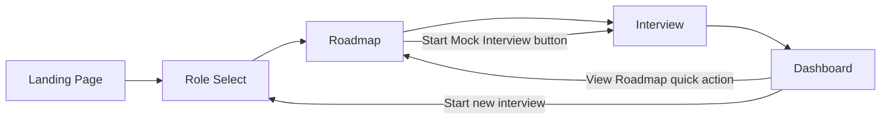

# CareerCopilot AI — UI & User Flow

**Status:** Approved Day 2 Design — Source of Truth

---

## 1. User Flow Diagram



**Design principle:** Every screen exists for exactly one reason, matching a specific PRD feature. There are 5 screens total — no extra screens, no dead ends.

| Screen | Reason It Exists (PRD Traceability) |
|---|---|
| Landing | First impression / value proposition — sets expectations before commitment |
| Role Select | FR-1 — predefined role selection |
| Roadmap | FR-2, FR-3 — AI roadmap + milestone tracking |
| Interview | FR-4–FR-7 — conversational mock interview |
| Dashboard | FR-8 — readiness score, history, learning progress |

---

## 2. Screen Flow & Navigation

- **Linear primary path:** Landing → Role Select → Roadmap → Interview → Dashboard. A first-time user can complete this without ever needing to use back navigation.
- **Shared header** appears on every screen except Landing's hero: logo/wordmark (links to Landing) + a lightweight nav (Dashboard link, visible once the user has any localStorage data).
- **Re-entry loops:** From Dashboard, "Start New Interview" returns to Role Select; "View Roadmap" returns to the current role's Roadmap screen — this supports repeat use without forcing a full restart.
- **No dead ends:** Every screen has a clear forward action and a way back to Dashboard/Landing via the header.

---

## 3. Low-Fidelity Wireframes

### 3.1 Landing Page (`index.html`)

```
┌──────────────────────────────────────────────────────┐
│  [Logo] CareerCopilot AI                              │
├──────────────────────────────────────────────────────┤
│                                                        │
│              CareerCopilot AI                         │
│   Your AI-powered career companion for learning,      │
│   interview preparation, and professional growth.     │
│                                                        │
│            [   Get Started  →   ]                     │
│                                                        │
│   ┌────────────┐  ┌────────────┐  ┌────────────┐      │
│   │ AI Roadmap │  │ Mock       │  │ Readiness  │      │
│   │            │  │ Interview  │  │ Dashboard  │      │
│   └────────────┘  └────────────┘  └────────────┘      │
│                                                        │
└──────────────────────────────────────────────────────┘
```
**Purpose:** Communicate value prop in <5 seconds, one clear CTA ("Get Started"), three feature teaser cards (no functionality, just orientation).

---

### 3.2 Role Select (`role-select.html`)

```
┌──────────────────────────────────────────────────────┐
│  [Logo] CareerCopilot AI              [Dashboard]     │
├──────────────────────────────────────────────────────┤
│  Choose your target role                              │
│                                                        │
│  ┌──────────────────────┐  ┌──────────────────────┐   │
│  │ ★ AI/ML Engineer      │  │ Data Analyst         │   │
│  │   Intern (Featured)   │  │                      │   │
│  └──────────────────────┘  └──────────────────────┘   │
│  ┌──────────────────────┐  ┌──────────────────────┐   │
│  │ Frontend Developer    │  │ Full Stack Developer │   │
│  └──────────────────────┘  └──────────────────────┘   │
│  ┌──────────────────────┐                              │
│  │ Software Developer    │                              │
│  └──────────────────────┘                              │
│                                                        │
│                [   Continue  →   ]                     │
└──────────────────────────────────────────────────────┘
```
**Purpose:** Single decision point — select one of 5 roles. AI/ML Engineer Intern visually marked as the flagship/most-detailed option per PRD, without restricting other choices.

---

### 3.3 Roadmap (`roadmap.html`)

```
┌──────────────────────────────────────────────────────┐
│  [Logo] CareerCopilot AI              [Dashboard]     │
├──────────────────────────────────────────────────────┤
│  Your Roadmap: AI/ML Engineer Intern                  │
│                                                        │
│  Core Skills                                           │
│  [Python] [ML Fundamentals] [SQL] [Model Eval] ...     │
│                                                        │
│  Learning Sequence                                      │
│  ☑ 1. Python & data handling         [details ▾]      │
│  ☐ 2. Core ML concepts               [details ▾]      │
│  ☐ 3. Model evaluation                [details ▾]      │
│                                                        │
│  Recommended Resources                                  │
│  ┌────────────────────┐  ┌────────────────────┐        │
│  │ Scikit-learn Docs   │  │ Kaggle Micro-       │        │
│  │ Documentation        │  │ courses              │        │
│  └────────────────────┘  └────────────────────┘        │
│                                                        │
│            [  Start Mock Interview  →  ]                │
└──────────────────────────────────────────────────────┘
```
**Purpose:** Show the AI-generated roadmap; checkboxes are the only interactive element besides the CTA. Loading state (skeleton cards) shown while Gemini responds.

---

### 3.4 Interview (`interview.html`)

```
┌──────────────────────────────────────────────────────┐
│  [Logo] CareerCopilot AI     Readiness: 74%  [Dash]    │
├──────────────────────────────────────────────────────┤
│  Question 3 of 5                    ●●●○○              │
│                                                        │
│  ┌────────────────────────────────────────────────┐   │
│  │ "Walk me through how you'd handle a dataset     │   │
│  │  with duplicate records."                        │   │
│  └────────────────────────────────────────────────┘   │
│                                                        │
│  ┌────────────────────────────────────────────────┐   │
│  │ [ your answer text area ]                        │   │
│  │                                                    │   │
│  └────────────────────────────────────────────────┘   │
│                    [   Submit Answer   ]                │
│                                                        │
│  ── after submission ──                                │
│  Feedback                                                │
│  ✓ Strengths: ...                                       │
│  → Improve: ...                                          │
│  ★ Stronger example: ...                                 │
│                    [   Next Question →   ]               │
└──────────────────────────────────────────────────────┘
```
**Purpose:** The core feature screen. One question, one answer box, one feedback reveal, one forward action at a time — deliberately linear to avoid overwhelming the user. Progress indicator and live score always visible in the header.

**Final state (after Question 5):** Same layout, but "Next Question" becomes "Finish Interview," leading to a Summary state (overall feedback, final score, recommended topics, "View Dashboard" button).

---

### 3.5 Dashboard (`dashboard.html`)

```
┌──────────────────────────────────────────────────────┐
│  [Logo] CareerCopilot AI                               │
├──────────────────────────────────────────────────────┤
│  Your Progress                                          │
│                                                        │
│  ┌────────────────┐  ┌────────────────────────────┐    │
│  │ Readiness Score │  │ Learning Progress            │    │
│  │      78%         │  │ AI/ML Engineer Intern        │    │
│  │  (avg, 3 sessions)│  │ ▓▓▓▓▓▓░░░░  6 of 10 done    │    │
│  └────────────────┘  └────────────────────────────┘    │
│                                                        │
│  Interview History                                       │
│  ┌────────────────────────────────────────────────┐   │
│  │ Date        Role                  Score          │   │
│  │ Aug 7       AI/ML Engineer Intern  🟢 82%         │   │
│  │ Aug 6       Data Analyst           🟡 64%         │   │
│  └────────────────────────────────────────────────┘   │
│                                                        │
│    [ Start New Interview ]   [ View Roadmap ]           │
└──────────────────────────────────────────────────────┘
```
**Purpose:** At-a-glance summary of everything persisted in localStorage. Empty state (first-time user) replaces history table + score card with a single friendly prompt card: "You haven't completed a mock interview yet — start one now."

---

## 4. Navigation Summary

| From | Action | To |
|---|---|---|
| Landing | "Get Started" | Role Select |
| Role Select | "Continue" | Roadmap |
| Roadmap | "Start Mock Interview" | Interview |
| Interview | "Finish Interview" (after Q5) | Interview Summary state |
| Interview Summary | "View Dashboard" | Dashboard |
| Dashboard | "Start New Interview" | Role Select |
| Dashboard | "View Roadmap" | Roadmap (current role) |
| Header logo (any screen) | click | Landing |
| Header "Dashboard" link (any screen with data) | click | Dashboard |

Every screen change is confirmed to trace back to a PRD feature — no screen was added for polish alone.
